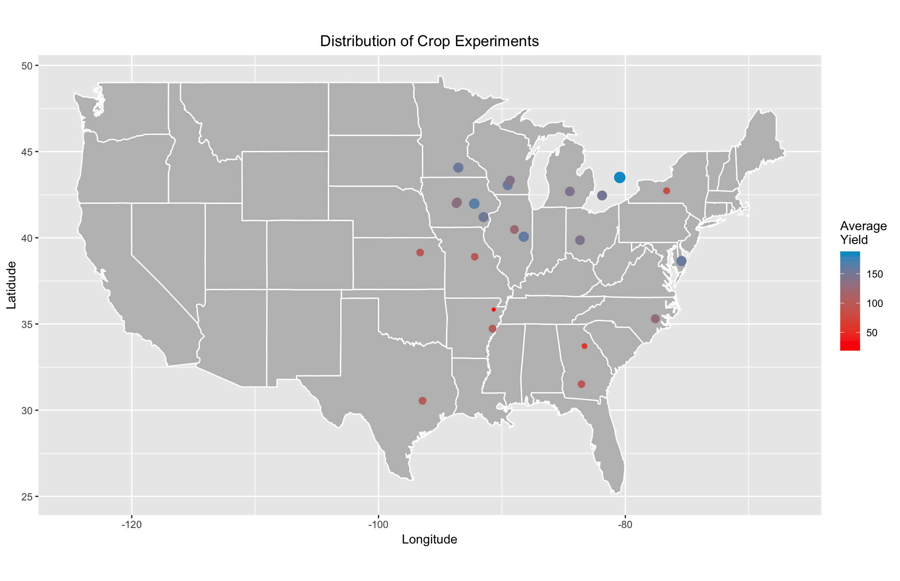
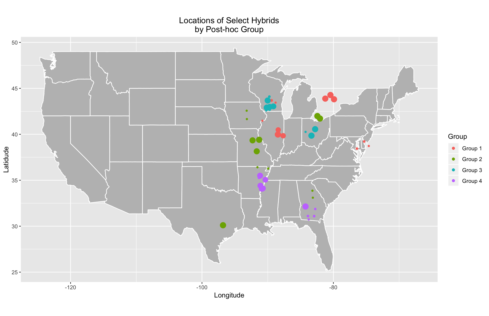

# Making Human Readable Visualizations

We want to ensure both researchers and practioners alike will understand the results of our post-hoc analysis. Because the output of the analysis is rather extensive, visualizing results past those seen previously can be a massive undertaking. Consequently, it is a challenge to make code for the figures easy to follow and to choose the proper results to visualize. Our goal for this walkthrough is to extend our work in the post-hoc analysis page by highlighting various results through different types of human-readable figures.

## Shiny Apps

R has the ability to run dynamic web-based apps, called Shiny apps. Shiny apps may be hosted on a server, or they may be simply ran on a local machine. The apps are great for allowing viewers to choose their own different options or formats to visualize the data you want to present. Obviously, the primary downside of Shiny apps is the issue of hosting. Nonetheless, we have a couple apps hosted through RStudio that serve to visualize different aspects of the post-hoc analysis.

The first Shiny app is one which allows users to choose several different hybrids and plot their Yield distributions via violin plots. There is also an option to split the hybrids into their respective groups in order to see how hybrids that are associated with more than one weather profile differ across post-hoc groups. We won't provide all the code to produce the app in this walkthrough because it is extensive and may be found at this [link](https://github.com/TACC/EnviroTyping/blob/Tutorial_Additions/sandbox/posthoc_group_analysis/2016/violin_app/app.R). If you desire to run the app on your local machine, you must download the whole folder entitled `violin_app` and ensure any directory references match those in your own R workspace. __*However, you may also see the app hosted online [here](https://bno5761.shinyapps.io/violin_app/)*__. 

The second Shiny app is one which provides a more in-depth look at the weather profiles of the respective groups. Users may choose any group and see how any number of the significant weather variables determine its weather profile. Further, users may select different scales for the *y*-axis and treat NAs as 0s in order to identify trends more clearly. The code for this app is much more extensive than the violins, so may find the code to run the app locally [here](https://github.com/TACC/EnviroTyping/blob/Tutorial_Additions/sandbox/posthoc_group_analysis/2016/profiles_app/app.R). Like with the violin plots app, the app to visualize the weather profiles is also online. __*It may be utilized at this [page](https://bno5761.shinyapps.io/profiles_app/)*__.

Of course, many more apps could be produced; and you are more than welcome to help in our effort.

## Maps

Recall that one of our main goals of EnviroTyping is to identify which weather variables contribute to the differences in GxE. Simply looking at results from an analysis of the post-hoc weather profiles (as in the aforementioned app) will go only so far because there is still room for human inference to decide the climate each profile reflects. We bridge the gap between the post-hoc results and human inference by plotting on a map the locations of the hybrids and looking for trends in clusters of hybrids that are associated with certain groups.

Because our ultimate goal is to produce maps, we need to ensure the data include longitude and latitude coordinates for the crop experiments. The process of obtaining coordinates is straightforward: merge the variables `Weather station latitude` and `Weather station longitude` from the file `EnviroTyping/data/external/G2F/g2f_2016_field_metadata.csv` on the variable `Exp` in `EnviroTyping/sandbox/posthoc_group_analysis/2016/posthocgroup.rds`. To make the process simpler, however, we simply provide the final output of the merge via the file `EnviroTyping/sandbox/posthoc_group_analysis/2016/hyb_by_mon_posthoc_map.rds`. We must pre-process some of the data before producing the figures.

```library(tidyverse) # for easier figure production
library(maps) # for map production
library(mapdata) # for map boundaries
library(ggrepel) # for proper labelling

min_max_scale <- function(x){
    return ((x - min(x,na.rm=TRUE)) / (max(x,na.rm=TRUE) - min(x,na.rm=TRUE)))
} # for producing scalable points

hyb_by_mon_posthoc_map = read_rds("~/RProjects/Maps/hyb_by_mon_posthoc_map.rds") # load the post-hoc hybrid with geography data
```

A quick glance of `hyb_by_mon_posthoc_map` reveals the geographic data of four Experiment locations (those in Iowa) are missing, so we replace the NAs with the proper longitude and latitude data.

```
# Tidy locations in Iowa
hyb_by_mon_posthoc_map$Lat[hyb_by_mon_posthoc_map$Exp == "IAH1"] = 41.99762
hyb_by_mon_posthoc_map$Lon[hyb_by_mon_posthoc_map$Exp == "IAH1"] = -93.69622
hyb_by_mon_posthoc_map$Lat[hyb_by_mon_posthoc_map$Exp == "IAH2"] = 42.06750
hyb_by_mon_posthoc_map$Lon[hyb_by_mon_posthoc_map$Exp == "IAH2"] = -93.61800   
hyb_by_mon_posthoc_map$Lat[hyb_by_mon_posthoc_map$Exp == "IAH3"] = 41.97589
hyb_by_mon_posthoc_map$Lon[hyb_by_mon_posthoc_map$Exp == "IAH3"] = -92.24096   
hyb_by_mon_posthoc_map$Lat[hyb_by_mon_posthoc_map$Exp == "IAH4"] = 41.19938
hyb_by_mon_posthoc_map$Lon[hyb_by_mon_posthoc_map$Exp == "IAH4"] = -91.49214 
```

Next, we load data pertaining to maps of the United States and Canada. We also perform a step to ensure we use the same verbage across all datasets when referring to geographic data.

```
usa = map_data("usa")
states = map_data("state")
canada = map_data("world","canada") # This is not used in our analysis, but it can be utilized in the future.
stations = hyb_by_mon_posthoc_map %>% select(Exp, "lat" = Lat, "long" = Lon) %>% distinct()

# Adding Iowa geo info from 2015 to station data

stations$lat[6:9] = c(41.99762,42.06750,41.97589,41.19938)
stations$long[6:9] = c(-93.69622,-93.61800,-92.24096,-91.49214)
```

We are almost ready to produce our first figure that will illustrate which Experiment locations produce the greatest Yield. We want our figure to be read and understood quickly, so we will add an effect that changes the size of the points based upon the value of interest (Yield). It should be noted, though, the last line in the following step adds three different variables, each of which may be used as a type of scaling. We find the `min_max_Mean` scaling variable works best for our purposes.

```
dot_size_Exp = hyb_by_mon_posthoc_map %>% group_by(Exp) %>% 
    summarize(Mean = mean(Yield,na.rm = TRUE)) %>%
    mutate(ln_Mean = log(Mean),min_max_Mean = 3*abs(min_max_scale(Mean))+1,scale_Mean = abs(scale(Mean))) # 3 is arbitrary; any scalar can be chosen

```

Now, we can produce the figures we initially supposed. The first figure illustrates all the crop experiments, colors the locations based upon their average Yields, and scales the point sizes based upon magnitude of the means. We exclude the outline for Ontario because including the map of Canada alters the scaling of the map deleteriously, but the Experiment locations in Ontario are still depicted. 

```
ggplot() + geom_polygon(data = states, aes(x = long, y = lat, group = group), fill = "grey", color = "white") +
    #geom_polygon(data = canada, aes(x = long, y = lat, group = group), color = "white") +
    geom_point(data = stations, aes(x = long, y = lat, color = dot_size_Exp$Mean), size = dot_size_Exp$min_max_Mean) + 
    scale_color_gradient(low = "red", high = "deepskyblue3",name = "Average\nYield") +
    guides(fill=guide_legend(title="Average Yield")) + 
    labs(title = "Distribution of Crop Experiments", x = "Longitude", y = "Latidude") +
    theme(plot.title = element_text(hjust=0.5)) +
    coord_fixed(1.4)
```

h


Clearly, there are trends in the average Yield across Experiment locations. The locations in the upper-Midwest appear to produce much larger quantities of corn than those in the South. However, there is still room for speculation as to which weather profile matches which climate. Because Experiments are not assigned to post-hoc groups, we need to plot the locations of the hybrids themselves, coloring the points based upon their groups, to analyze any macro-level trends in the spread of the weather profiles. We assume that plotting the best and worst performers will help us reach that goal. We first need to isolate our data of interest in each group.

```
# Filter by group

group1 = hyb_by_mon_posthoc_map %>% filter(group==1) %>% select(Exp,Pedi,Yield,clus,Lat,Lon)
group2 = hyb_by_mon_posthoc_map %>% filter(group==2) %>% select(Exp,Pedi,Yield,clus,Lat,Lon)
group3 = hyb_by_mon_posthoc_map %>% filter(group==3) %>% select(Exp,Pedi,Yield,clus,Lat,Lon)
group4 = hyb_by_mon_posthoc_map %>% filter(group==4) %>% select(Exp,Pedi,Yield,clus,Lat,Lon)

# Summarize data and add variables to describe scaling to later use in making of dot sizes

group1_mean = group1 %>% group_by(Exp,Pedi) %>% 
    summarize(Mean = mean(Yield,na.rm = TRUE))
group1_mean = left_join(group1_mean,stations,by = NULL) %>%
    arrange(desc(Mean)) %>% 
    mutate(ln_Mean = log(Mean),min_max_Mean = 3*abs(min_max_scale(Mean))+1,scale_Mean = abs(scale(Mean)))

group2_mean = group2 %>% group_by(Exp,Pedi) %>% 
    summarize(Mean = mean(Yield,na.rm = TRUE)) 
group2_mean = left_join(group2_mean,stations,by = NULL) %>%
    arrange(desc(Mean)) %>%
    mutate(ln_Mean = log(Mean),min_max_Mean = 3*abs(min_max_scale(Mean))+1,scale_Mean = abs(scale(Mean)))

group3_mean = group3 %>% group_by(Exp,Pedi) %>% 
    summarize(Mean = mean(Yield,na.rm = TRUE))
group3_mean = left_join(group3_mean,stations,by = NULL) %>%
    arrange(desc(Mean)) %>% 
    mutate(ln_Mean = log(Mean),min_max_Mean = 3*abs(min_max_scale(Mean))+1,scale_Mean = abs(scale(Mean)))

group4_mean = group4 %>% group_by(Exp,Pedi) %>% 
    summarize(Mean = mean(Yield,na.rm = TRUE))
group4_mean = left_join(group4_mean,stations,by = NULL) %>%
    arrange(desc(Mean)) %>% 
    mutate(ln_Mean = log(Mean),min_max_Mean = 3*abs(min_max_scale(Mean))+1,scale_Mean = abs(scale(Mean)))

# Combine the top and bottom performers for each group 

top_bottom_1 = rbind(head(group1_mean),tail(group1_mean))
top_bottom_2 = rbind(head(group2_mean),tail(group2_mean))
top_bottom_3 = rbind(head(group3_mean),tail(group3_mean))
top_bottom_4 = rbind(head(group4_mean),tail(group4_mean))
```

Because all hybrids at the same Experiment will have the same coordinates, we allow for a small amount of jitter in the plotting of their locations in order to more aptly identify the trends. Consequently, any figures produced using the following code may have slightly different locations for the points; but the overall patterns will be the same.

```
ggplot() + geom_polygon(data = states, aes(x = long, y = lat, group = group), fill = "grey", color = "white") +
    geom_point(data = top_bottom_1, aes(x = long, y = lat, color = "#019E73"), size = top_bottom_1$min_max_Mean, position = position_jitter(w = 1, h = 0.8)) + 
    geom_point(data = top_bottom_2, aes(x = long, y = lat, color = "#57B4E9"), size = top_bottom_2$min_max_Mean, position = position_jitter(w = 1, h = 0.8)) +    
    geom_point(data = top_bottom_3, aes(x = long, y = lat, color = "#E69F00"), size = top_bottom_3$min_max_Mean, position = position_jitter(w = 1, h = 0.8)) + 
    geom_point(data = top_bottom_4, aes(x = long, y = lat, color = "#F0E442"), size = top_bottom_4$min_max_Mean, position = position_jitter(w = 1, h = 0.8)) +
    scale_color_discrete(labels=c("Group 1","Group 2","Group 3","Group 4"),name = "Group") +
    guides(fill=guide_legend(title="Group")) + 
    labs(title = "Locations of Select Hybrids\nby Post-hoc Group", x = "Longitude", y = "Latidude") +
    theme(plot.title = element_text(hjust=0.5)) +
    coord_fixed(1.4)
```




Show code for each step
Examples
Code

