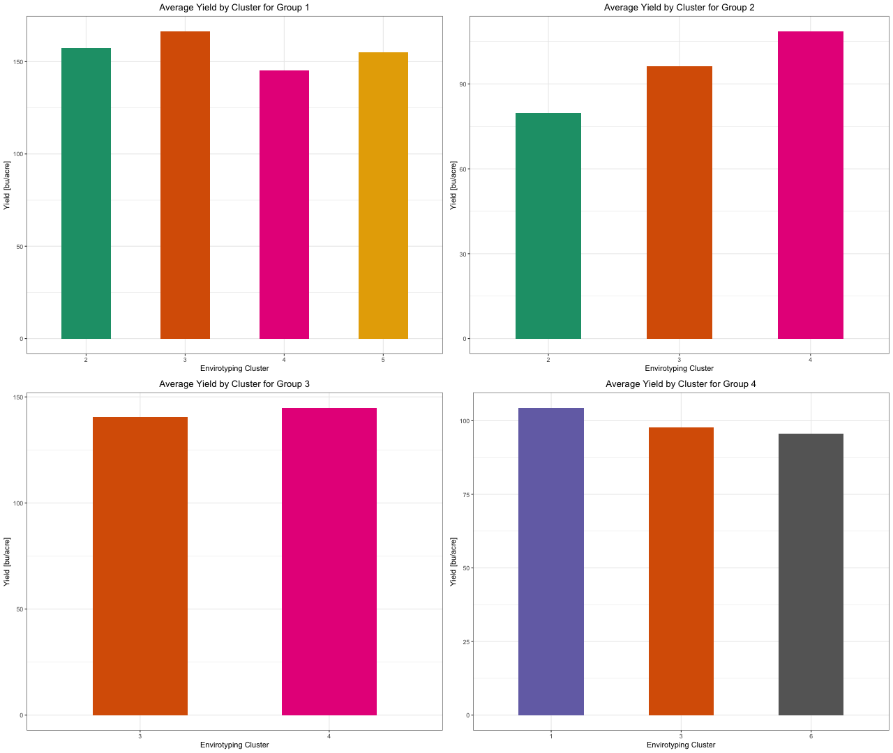
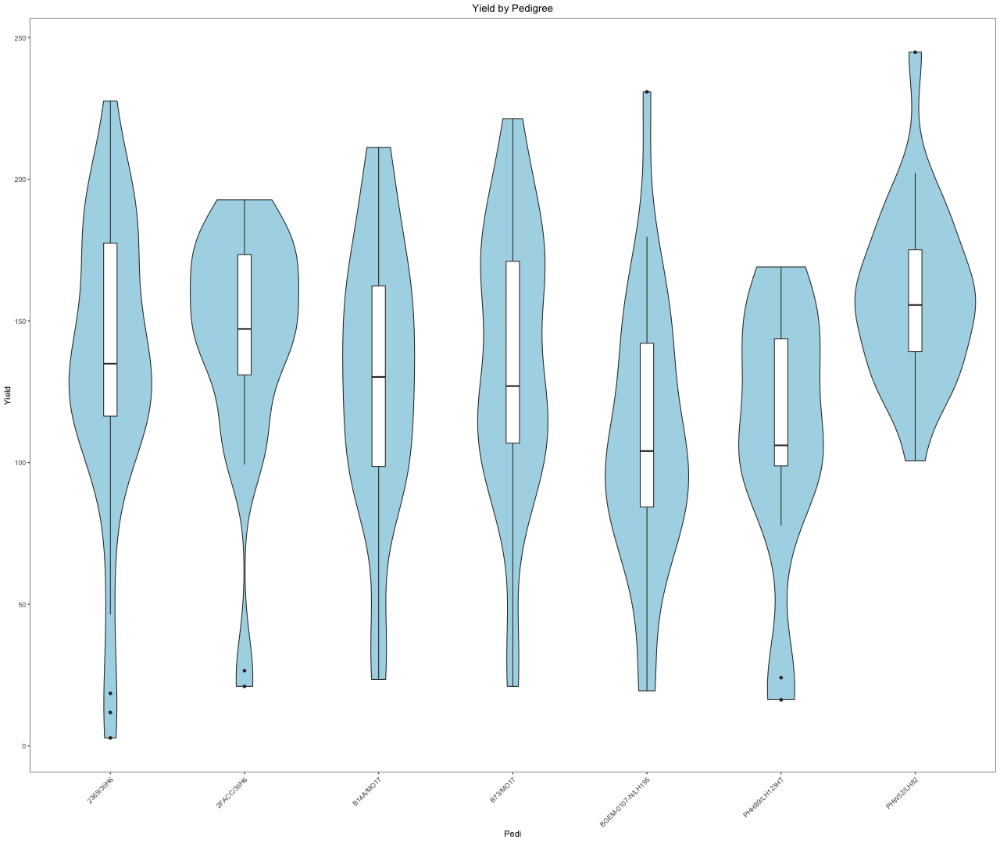
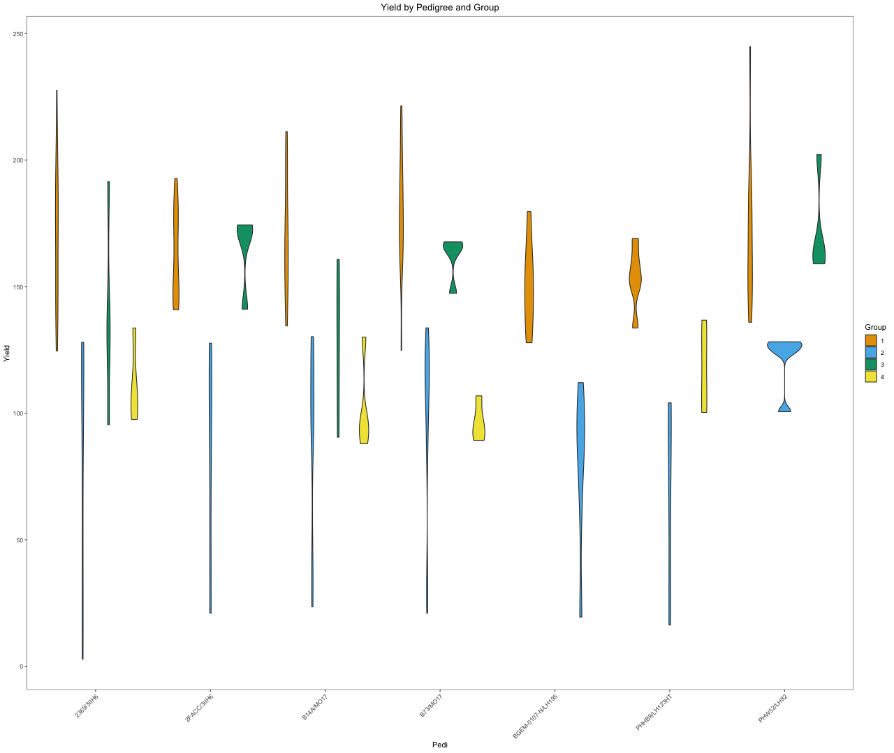

# 2016 Post-hoc Analysis

After running the G2F hybrid/weather data through the PReMiuM package there is a large amount of output. There are also many hybrids, so further analysis is needed to answer a few high-level questions:

1.  Which hybrids have profile-clusters that are most different from
    each other (i.e. have the most g x e)?
2.  Which weather variables are most important for making
    profile-clusters that differ across hybrids, i.e. which covariates
    contribute the most to gxe?
3.  Which hybrid-profile clusters define the most similar fields (i.e.
    which field sites are the most redundant)?
4.  Which hybrids diagnose specific envirotype groups?

Before we get started, we need to ensure several packages are loaded into our environment. If you do not currently have these packages, install them before continuing. 

```{r}
library(amap)
library(dynamicTreeCut)
library(cluster)
library(dendextend)
library(lubridate)
library(gridExtra)
library(viridis)
library(tidyverse)
library(reshape2)
library(PReMiuM)
```

## Pre-processing the Data

*All below steps, information, and figures are based upon the 2016 monthly, calibrated, and shifted hybrid data. We conduct an analysis on the minima of the variables with non-zero variance.*

Our first goal is to make a single dataframe which includes the yields, hybrid names, and the clusters to which the hybrids are assigned. We will deal with several different paths across the directory, so it's best to first set a working directory that matches file paths on your local machine. If you desire to see the risk profile of certain variables of interest before continuing the analysis, we provide the code to do so in the below snippet, as well.

```{r}
setwd("/Users/banks/RProjects/EnviroTyping/sandbox/shifted_data_analysis/2016")

# Bring in hybrid identifier (col 1), experiment identifier (2), and yield (15) observations 
pedi = read_rds("../../../data/interim/2016/hyb_by_mon_calib_wide_shifted.rds")[,c(1,2,15)]

riskProfObj = read_rds("min_vars_3000/riskProfObj.rds") # Load the min_vars riskProfObj

# Run the below code with different indices to see the risk profile of different variables:
# plotRiskProfile(riskProfObj,
#                 whichCovariates=riskProfObj$riskProfClusObj$clusObjRunInfoObj$covNames[11:20],
#                 outFile="../../working_with_plots/BanksPlots/profile_plot.png")

# Create new dataframe that adds the cluster identifier variable as "clus"
hyb_by_mon_clus = data.frame(clus = as.factor(riskProfObj$riskProfClusObj$clustering),pedi,
                             riskProfObj$riskProfClusObj$clusObjRunInfoObj$xMat[,-1])

colnames(hyb_by_mon_clus) # To verify you have the cluster identifier with other variables
```

## Refine the Clusters

Next, we further group the PReMiuM clusters into more-refined post-hoc groups because there are too many hybrid labels within each cluster to make strong qualitative conclusions. An additional step of clustering is performed using aggolmerative hierarchical clustering to further break down the data. To do this, we utilize the function `hcluster` from the `amap` library because it allows for parallel computing.

During our analysis, we encountered an instance where the types of the variables Exp (experiment identifiers) and Pedi (hybrid identifiers) needed to be converted to factor type variables because they were initially read as character variables. If you come across a similar situation, we have provided our solution in the code below. Finally, we create a new dataframe that includes all of our variables of interest, the hybrids' PReMiuM cluster identifiers, and the hybrids' post-hoc group identifiers. 

```{r}
cores = parallel::detectCores()
posthocGroup = hcluster(hyb_by_mon_clus[,-1], method = "euclidean", link = "ward", nbproc = cores)

# The two categorical variables needed to be converted to type "Factor" to be used with daisy
hyb_by_mon_clus$Exp = as.factor(hyb_by_mon_clus$Exp)
hyb_by_mon_clus$Pedi = as.factor(hyb_by_mon_clus$Pedi)
str(hyb_by_mon_clus) # confirm the first three variables have type "Factor" and the rest "num"

# Establish post-hoc groups for further analysis
dist = daisy(hyb_by_mon_clus)
dynamicCutree = cutreeDynamic(posthocGroup, distM = as.matrix(dist), deepSplit = 4, verbose = 4) 
length(unique(dynamicCutree)) # the number of post-hoc groups should be 4
hyb_by_mon_posthoc = data.frame(group = dynamicCutree, hyb_by_mon_clus) # create a new dataframe with the post-hoc group
```

We would now like to produce some plots to help get a better understanding of the data and the underlying relationships. With a little work, we can answer some of the questions asked at the beginning of this page.

### Intermediate Steps

This section is provided simply to tidy the data and help make clean figures. It is up to you to employ these steps. First, we rearrange the columns to place them in order of month. This is because some variables will have observations from October (month 10) before earlier months. We also change the type of the variable "group" to factor to allow us to change figures' colors based upon the hybrids' groups. Lastly, we assign certain colors to the PReMiuM clusters and the post-hoc groups.

```{r}
hyb_by_mon_posthoc = hyb_by_mon_posthoc[c(3,4,5,1,2,7,8,6,9,10,11,12,13,14,15,16,17,19,20,18,21,22,24,25,23)]
# colnames(hyb_by_mon_posthoc) # can be used to see new order of variables

hyb_by_mon_posthoc$group = as.factor(hyb_by_mon_posthoc$group)

clus.colors = c("1"="#7570B3","2"="#1C9E77","3"="#D95F02","4"="#E72A8A","5"="#E6AB02","6"="#666666")
group.colors = c("1"="#E69F00","2"="#57B4E9","3"="#019E73","4"="#F0E442")
```

## Plotting the Results

We ultimately would like to understand the fundamental differences between the post-hoc groups. We will show several of the more interesting results here. First, we will show cluster yields by their post-hoc groups. 

```{r}
png("../../working_with_plots/BanksPlots/Figures/ClusterYieldsbyGroup.png", width = 1280, height = 1080)
l = list()
for (i in 1:4){
    tmp = hyb_by_mon_posthoc %>% filter(group == i)
    p = ggplot(tmp,aes(clus, Yield)) + 
        geom_bar(aes(fill = clus), width = .5, stat = "summary", fun.y = "mean") + 
        scale_fill_manual(values=clus.colors) +
        labs(title = paste("Average Yield by Cluster for Group",i,sep = " "), x = "Envirotyping Cluster", y = "Yield [bu/acre]") +
        theme_bw() + 
        theme(plot.title = element_text(hjust = 0.5)) + 
        guides(fill=FALSE)
    l[[i]] = p
}
grid.arrange(l[[1]],l[[2]],l[[3]],l[[4]])
dev.off()
```

The above code produces:



The *y*-value, Average Yield, is plotted across each cluster in every group. Clearly, there are differences across the post-hoc groups. Despite the same cluster appearing in multiple groups, each group appears to have its own characteristics. For example, Cluster 3 appears in each post-hoc group; but the cluster behaves uniquely across groups. The average Yield for Cluster 3 is over 150 bu/acre in Group 1, but is slightly below 100 bu/acre in Groups 2 and 4. Likewise, the average Yield for each cluster within Group 1 is close to 150 bu/acre; but there is a large range for the average yield of the clusters in Group 2. As such, it may be inferred that clusters within any given post-hoc group exhibit similar weather profiles to the other clusters within the same group. We would like to see if the different weather profiles have other effects on Yield.

### Group Characteristics

We first want to uncover more of the differences between the groups. We'll do so by identifying several hybrids that appear in multiple groups and analyzing the distribution of the Yield variable by hybrid. First, we want to identify the hybrids that appear in multiple groups.

```{r}
hyb_by_mon_posthoc_sort = hyb_by_mon_posthoc %>% # To get dataframe with hybrids and respective groups
    group_by_(.dots=c("Pedi","group","clus")) %>%
    tally() %>% 
    select(-n)
```

Next, we arbitrarily choose a handful of hybrids to plot their distributions. The hybrids of interest can be any of the hybrids in the data.

```{r}
# We assign the identifiers of our hybrids of interest to their own vector (any can be chosen)

hyb_of_interest = c("2369/3IIH6","2FACC/3IIH6","B14A/MO17","B73/MO17","BGEM-0107-N/LH195","PHHB9/LH123HT","PHW52/LH82")
```

Since we want the distribution of Yield for each particular hybrid of interest, we will make violin plots for the hybrids. We must note, however, there existed an apparent issue when we initially made the figure: an extra violin was generated that described the distribution of all of the hybrids in the hyb_of_interest vector. The issue is rectified by subsetting only the data of interest.

```{r}
hyb_by_mon_interest = hyb_by_mon_posthoc %>% filter(Pedi %in% hyb_of_interest)
```

The above step may be skipped if you do not encounter similar issues. Whether or not the data are subsetted, the following steps to produce the violin plots are fairly standard. We first show the distribution of the hybrids' Yield without group identifiers but with boxplots that descibe the distributions' five number summaries. As should be expected, each hybrid exhibits different characteristics. For example, hybrid 2369/3IIH6 produces a large range of values for Yield, even some of the greatest values; but the hybrid also produces some of the lowest outliers, as well. On the other hand, hybrid PHW52/LH82 has the smallest range for Yield and also has the greatest median. Similar inferences may be made for the other hybrids.

```{r}
png("../../working_with_plots/BanksPlots/Figures/ViolinbyPedi.png", width = 1280, height = 1080)
ggplot(hyb_by_mon_interest,aes(x = factor(Pedi,level = c("2369/3IIH6","2FACC/3IIH6","B14A/MO17","B73/MO17","BGEM-0107-N/LH195","PHHB9/LH123HT","PHW52/LH82")),y = Yield)) + 
    labs(title = "Yield by Pedigree and Group",x = "Pedi",y = "Yield") +
    geom_violin(fill = "#ADD8E6") + 
    geom_boxplot(width=0.1) + 
    scale_fill_manual(values=group.colors) +
    theme_bw() +
    theme(axis.text.x = element_text(angle=45,hjust=1), plot.title = element_text(hjust = 0.5))
dev.off()
```



Of course, we want to know if there are any differences across groups for a particular hybrid. Plotting Yield by Pedi and group reveal interesting insights into the nature of each group. For example, Group 1 produces the greatest yield for each hybrid associated with that weather profile. Group 2 tends to have the greatest range of Yield and is associated with the lowest output for each hybrid in that group. Groups 3 and 4 appear to produce Yield somewhere between Groups 1 and 2. These distributions allow us to infer that hybrids grow significantly different in varying climates. Even more so, there exists a "best" climate for each particular hybrid. In other words, each hybrid's Yield may be maximized by planting it in its preferred climate that matches its weather profile.

```{r}
png("../../working_with_plots/BanksPlots/Figures/ViolinbyGroup.png", width = 1280, height = 1080)
ggplot(hyb_by_mon_interest,aes(x = factor(Pedi,level = c("2369/3IIH6","2FACC/3IIH6","B14A/MO17","B73/MO17","BGEM-0107-N/LH195","PHHB9/LH123HT","PHW52/LH82")),y = Yield,fill = group)) + 
    geom_violin() + 
    scale_fill_manual(values=group.colors,name="Group") + 
    labs(title = "Yield by Pedigree and Group",x = "Pedi",y = "Yield") + 
    theme_bw() + 
    theme(axis.text.x = element_text(angle=45,hjust=1), plot.title = element_text(hjust = 0.5))
dev.off()
```



It is now clear the post-hoc groups have different weather profiles. These profiles may be extracted from the data by identifying the minimum, median, and maximum values for each weather covariate by group. Because the profiles produce several large figures, we do not provide the plots in this guide. The weather profiles for each group may be seen in the EnviroTyping GitHub under `sandox/working_with_plots/Figures/Banks_Post-HocAnalysisofWeather Profiles.pdf`.

### Group Composition

We can also obtain a detailed description of the composition of each group. Specifically, we can identify the hybrids associated with each post-hoc group. We can refine this idea further by identifying the hybrids' PReMiuM cluster association within each group, as well. The following code first counts the number of times each hybrid is an observation, then shows the number of experiments in each group. We do not provide the code to filter the group data by cluster, but it may be found in the EnviroTyping GitHub repository under `sandbox/posthoc_group_analysis/2016/posthoc_analysis.R`.

```{r}
Pedi_count = as.data.frame(table(hyb_by_mon_posthoc$Pedi)) # To show number of times hybrid is used
table(hyb_by_mon_posthoc$group,hyb_by_mon_posthoc$Exp) # To show distribution of experiments in each group
```

Next, we create new dataframes for Group 1, Group 2, Group 3, and Group 4 which include the hybrid names, experiment locations, crop output, and PReMiuM cluster identifier. Separating the hybrids into the their respective groups allows us to create simple .csv files which list the groups' compositions.

```{r}
group1 = hyb_by_mon_posthoc %>% filter(group==1) %>% select(Exp,Pedi,Yield,clus)
group1_hybrids = as.data.frame(unique(group1$Pedi)); colnames(group1_hybrids) = "Hybrid" # To generate list of hybrids in Group 1
table(group1$clus,group1$Exp) # To see experiments in each cluster

group2 = hyb_by_mon_posthoc %>% filter(group==2) %>% select(Exp,Pedi,Yield,clus)
group2_hybrids = as.data.frame(unique(group2$Pedi)); colnames(group2_hybrids) = "Hybrid" # To generate list of hybrids in Group 2
table(group2$clus,group2$Exp) # To see experiments in each cluster

group3 = hyb_by_mon_posthoc %>% filter(group==3) %>% select(Exp,Pedi,Yield,clus)
group3_hybrids = as.data.frame(unique(group3$Pedi)); colnames(group3_hybrids) = "Hybrid" # To generate list of hybrids in Group 3
table(group3$clus,group3$Exp) # To see experiments in each cluster

group4 = hyb_by_mon_posthoc %>% filter(group==4) %>% select(Exp,Pedi,Yield,clus)
group4_hybrids = as.data.frame(unique(group4$Pedi)); colnames(group4_hybrids) = "Hybrid" # To generate list of hybrids in Group 4
table(group4$clus,group4$Exp) # To see experiments in each cluster

# Save lists of hybrids as separate files 
write_csv(group1_hybrids,"../../posthoc_group_analysis/2016/Group1.csv")
write_csv(group2_hybrids,"../../posthoc_group_analysis/2016/Group2.csv")
write_csv(group3_hybrids,"../../posthoc_group_analysis/2016/Group3.csv")
write_csv(group4_hybrids,"../../posthoc_group_analysis/2016/Group4.csv")
```
